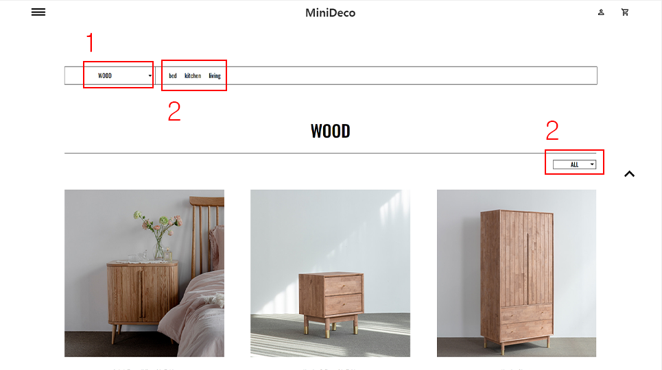
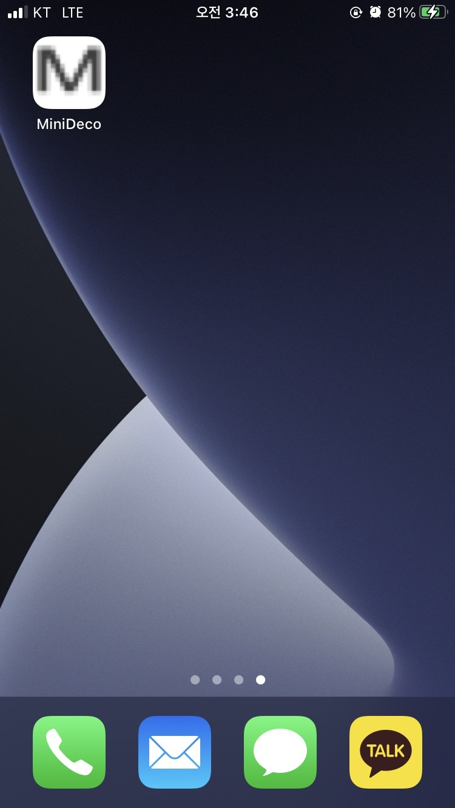

# Renewal_Project

> 기획 의도

    이번 프로젝트는 기존에 알고 있던 HTML, CSS 그리고 JavaScript 이론과 
    문법을 토대로 실무에 적용 할 수 있도록 연습해보는 첫 프로젝트입니다. 
    서버상에 존재하는 여러가지 사이트들중에서 
    업데이트가 필요한 사이트를 선정하고 단계적으로 접근해보며 제작하였습니다.

> 프로젝트 기간

    2021.06-2021.07

> Skill

    HTML, CSS, jQuery

> 화면 구성

* Main Page
* List Page
* Detail Page
* Login and Menu Popup
* QnA Page

>주요 기능
* slick

* 애니메이션

* 필터링 

* PWA build

> 주요 기능 설명

    리뉴얼 프로젝트를 제작하며 구현한 핵심 기능은 상품 진열 페이지에서 클라이언트가 원하는 상품만을 진열 해주는 필터링 기능입니다. 
    이 기능을 구현하면서 두 가지의 규칙을 세웠습니다.
    첫번째는 즉각적인 반응을 하는 것입니다. 필터링을 거치기 위해 사진에서 보이는것 처럼 최소 1번에서 최대 3번까지의 클릭을 걸쳐야 하지만 클릭을 할때 마다 즉각 적으로 필터링 하며 상품 리스트를 구현합니다. 
    두번째는 클릭의 순서와 상관없이 기능이 구현되도록 제작하였습니다. 

  

     반응형 작업하며 pwa를 build 하며 웹앱으로도 구현했습니다.   

>페이지 보러 가기 click [here](https://dlsdk0601.github.io/renualProject_jQuery/)

